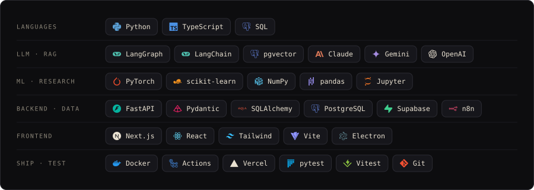

### `$ git log --contribution`

### `$ ls ~/pinned`

 
 
 

### `$ ls ~/research`

  

### `$ open ~/live`

  
  

### `$ cat ~/.stack`

### `$ history --weekly`

### `$ ls ~/more`

- [**ResearchOS**](https://github.com/Niloy-Bhuiyan/thesis-research-orchestrator) — watches long Kaggle training runs, fixes the safe failures itself and asks on Telegram before anything else
- [**leadbridge**](https://github.com/Niloy-Bhuiyan/leadbridge) — lead intake, AI triage, CRM upsert and an SEO audit, orchestrated in n8n over a tested Python service (127 tests)
- [**Switchyard**](https://github.com/Niloy-Bhuiyan/Switchyard) — control room for several AI coding agents; branches shadow-merge before they collide
- [**Agent-Paw**](https://github.com/Niloy-Bhuiyan/Agent-Paw) — a pixel cat that lives on your desktop, with a voice pipeline and a real Electron pet window
- [**heart-disease-fastapi**](https://github.com/Niloy-Bhuiyan/heart-disease-fastapi) — a scikit-learn classifier served through a documented FastAPI endpoint, in Docker

### `$ contact`

